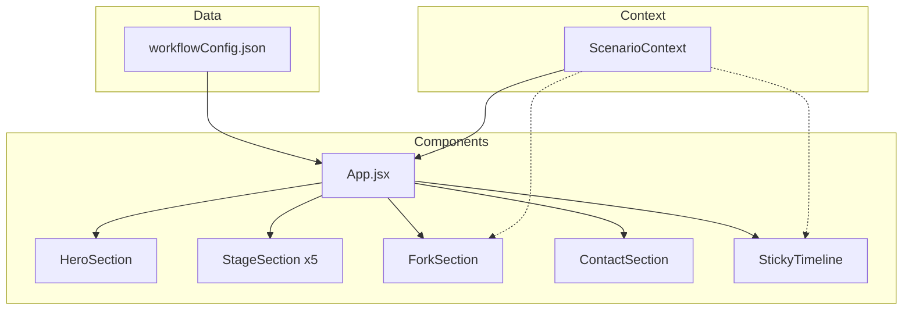

# Suburbia Studio — AI Showcase Web

> Інтерактивний лендінг для демонстрації гібридного workflow архітектурної візуалізації

---

## 🎯 Мета проекту

Створити **вау-ефектну презентацію** робочого процесу студії Suburbia Studio з:
- Темною преміальною естетикою
- Інтерактивним вибором сценаріїв (Precision vs Artistic)
- Плавними анімаціями та мікроінтеракціями
- Оптимізованим медіа-контентом

---

## 🏗️ Архітектура проекту

```
AI_Showcase_Web/
├── src/
│   ├── App.jsx                 # Головний компонент
│   ├── main.jsx                # Entry point (React + StrictMode)
│   ├── index.css               # Глобальні стилі + Tailwind
│   │
│   ├── components/
│   │   ├── layout/             # Структурні компоненти
│   │   │   ├── Layout.jsx      # Обгортка сторінки
│   │   │   ├── Header.jsx      # Навігація + лого
│   │   │   └── Footer.jsx      # Футер + копірайт
│   │   │
│   │   ├── sections/           # Секції контенту
│   │   │   ├── HeroSection.jsx      # Головний екран
│   │   │   ├── StageSection.jsx     # Звичайні етапи (1,2,4,5,6,7)
│   │   │   ├── ForkSection.jsx      # Етап 3 з розгалуженням
│   │   │   └── ContactSection.jsx   # Контактна форма
│   │   │
│   │   └── ui/                 # Перевикористовувані UI-елементи
│   │       ├── StickyTimeline.jsx   # Фіксований таймлайн внизу
│   │       ├── SmartMedia.jsx       # Оптимізований медіа-компонент
│   │       ├── MediaPlaceholder.jsx # Fallback placeholder
│   │       ├── KeyFocusBadge.jsx    # Бейдж ключового фокусу
│   │       └── Checkpoint.jsx       # Індикатор чекпоінту
│   │
│   ├── context/
│   │   └── ScenarioContext.jsx # React Context для A/B сценарію
│   │
│   ├── hooks/
│   │   └── useScrollProgress.js # Кастомний хук для відстеження скролу
│   │
│   └── data/
│       └── workflowConfig.json  # Дані workflow (етапи, опис, mediaUrl)
│
├── doc/
│   ├── master_prompt.md         # Вимоги до дизайну
│   └── desc.md                  # Цей файл (архітектура)
│
├── tailwind.config.js           # Конфігурація кольорів та тем
├── vite.config.js               # Vite налаштування
└── package.json                 # Залежності
```

---

## 🎨 Дизайн-система

### Кольорова палітра

| Токен | Значення | Призначення |
|-------|----------|-------------|
| `deep-black` | `#0A0A0F` | Основний фон |
| `surface` | `#12121A` | Карточки, панелі |
| `surface-light` | `#1A1A24` | Світліші поверхні |
| `surface-lighter` | `#252530` | Hover стани |
| `cyber-blue` | `#00D1FF` | Сценарій A (Precision) |
| `safety-orange` | `#FF8A00` | Сценарій B (Artistic) |
| `text-primary` | `#FFFFFF` | Заголовки |
| `text-muted` | `#A0A0B0` | Основний текст |
| `text-dim` | `#606070` | Другорядний текст |

### Типографіка

- **Шрифт**: Inter (Google Fonts)
- **Заголовки**: `font-bold`, градієнтний текст
- **Тіло**: `text-muted`, `leading-relaxed`

### Ефекти

| Клас | Опис |
|------|------|
| `glow-blue` | Статичне неонове світіння (синє) |
| `glow-orange` | Статичне неонове світіння (помаранчеве) |
| `glow-blue-pulse` | Пульсуюче світіння (синє) |
| `glow-orange-pulse` | Пульсуюче світіння (помаранчеве) |
| `text-gradient-blue` | Градієнтний текст (синій) |
| `text-gradient-orange` | Градієнтний текст (помаранчевий) |
| `glass` | Glassmorphism ефект |
| `animate-shimmer` | Shimmer анімація для плейсхолдерів |

---

## 🧩 Ключові компоненти

### `ScenarioContext`

Глобальний стан для вибору сценарію.

```jsx
const { scenario, selectScenario, isPrecision } = useScenario();
// scenario: 'A' | 'B'
// selectScenario('A') — змінює сценарій
// isPrecision: boolean (scenario === 'A')
```

### `StickyTimeline`

Фіксований таймлайн внизу екрану.

**Особливості:**
- Відстежує scroll position через `useScrollProgress`
- Анімований progress bar
- Кнопки етапів з плавним переходом
- Автоматична зміна кольору при перемиканні сценарію
- Клік → `scrollIntoView({ behavior: 'smooth' })`

### `ForkSection` (Етап 3)

Інтерактивний вибір між двома сценаріями.

**Особливості:**
- Картки з пульсуючим glow-ефектом
- Micro-copy підказки під кнопками
- `AnimatePresence` для плавних переходів
- Градієнтні заголовки sub-stages (3.1, 3.2)
- `layoutId` для анімації активного індикатора

### `SmartMedia`

Універсальний медіа-компонент.

**Функціонал:**
```
┌─────────────────────────────────────────────────┐
│ SmartMedia                                      │
├─────────────────────────────────────────────────┤
│ • Визначає тип медіа за URL (.mp4 → video)     │
│ • Cloudinary оптимізація (q_auto, f_auto)      │
│ • IntersectionObserver lazy loading            │
│ • Blur-up placeholder (low-res preview)        │
│ • Auto-video (muted, loop, playsinline)        │
│ • Graceful fallback на MediaPlaceholder        │
└─────────────────────────────────────────────────┘
```

### `useScrollProgress`

Кастомний хук для відстеження позиції скролу.

```jsx
const { activeStageId, progress } = useScrollProgress(stages, scenario);
// activeStageId: 1-7 (номер видимого етапу)
// progress: 0-100 (відсоток прогресу)
```

**Алгоритм:**
1. Використовує `getBoundingClientRect()` для реальних координат
2. Знаходить секцію, яка перетинає viewport
3. Враховує viewport offset (40% висоти)
4. Оновлюється на `scroll` та `resize` події

---

## 🔄 Потік даних



---

## ⚡ Технічні рішення

### 1. Tailwind Dynamic Classes

**Проблема:** Tailwind не бачить динамічні класи типу `bg-${color}`.

**Рішення:** Повні класи в умовах:
```jsx
// ❌ Не працює
className={`bg-${isPrecision ? 'cyber-blue' : 'safety-orange'}`}

// ✅ Працює
className={isPrecision ? 'bg-cyber-blue' : 'bg-safety-orange'}
```

### 2. Scroll-based Timeline

**Проблема:** Пропорційний підхід (% від загальної висоти) не враховує різну висоту секцій.

**Рішення:** DOM-based позиціонування:
```js
sections.forEach(section => {
    const rect = section.element.getBoundingClientRect();
    // Секція вважається active якщо її верх вище 40% viewport
    if (rect.top <= viewportHeight * 0.4) {
        activeId = section.id;
    }
});
```

### 3. Media Optimization

**Проблема:** Великі зображення сповільнюють завантаження.

**Рішення:** SmartMedia з Cloudinary:
```js
// Автоматична оптимізація URL
url.replace('/upload/', '/upload/q_auto,f_auto,w_1200/')

// Blur-up placeholder
url.replace('/upload/', '/upload/q_10,w_50,e_blur:500/')
```

### 4. Pulsing Glow Animation

**CSS анімація для "живого" ефекту:**
```css
@keyframes pulse-glow-blue {
    0%, 100% { box-shadow: 0 0 20px rgba(0,209,255,0.3); }
    50% { box-shadow: 0 0 30px rgba(0,209,255,0.5), 0 0 60px rgba(0,209,255,0.2); }
}
```

### 5. Framer Motion Transitions

**Перехід між сценаріями:**
```jsx
<AnimatePresence mode="wait">
    <motion.div
        key={scenario}
        initial={{ opacity: 0, y: 20 }}
        animate={{ opacity: 1, y: 0 }}
        exit={{ opacity: 0, y: -20 }}
    />
</AnimatePresence>
```

---

## 📦 Залежності

| Пакет | Версія | Призначення |
|-------|--------|-------------|
| `react` | 18.x | UI framework |
| `vite` | 5.x | Bundler |
| `tailwindcss` | 3.x | Styling |
| `framer-motion` | 11.x | Анімації |
| `lucide-react` | latest | Іконки |

---

## 🚀 Deployment

```bash
# Development
npm run dev

# Production build
npm run build

# Preview production
npm run preview
```

**Рекомендовані платформи:**
- Vercel (auto-deploy з GitHub)
- Netlify
- Cloudflare Pages

---

## 📋 Чекліст готовності

- [x] Project setup (Vite + Tailwind + Framer Motion)
- [x] Data layer (workflowConfig.json)
- [x] Core components (Header, Hero, Stages, Footer)
- [x] Fork section з A/B toggle
- [x] Sticky timeline
- [x] Visual polish (glow, gradients, micro-copy)
- [x] SmartMedia component
- [ ] Real media assets
- [ ] CTA integration (email, Calendly)
- [ ] Production deployment
